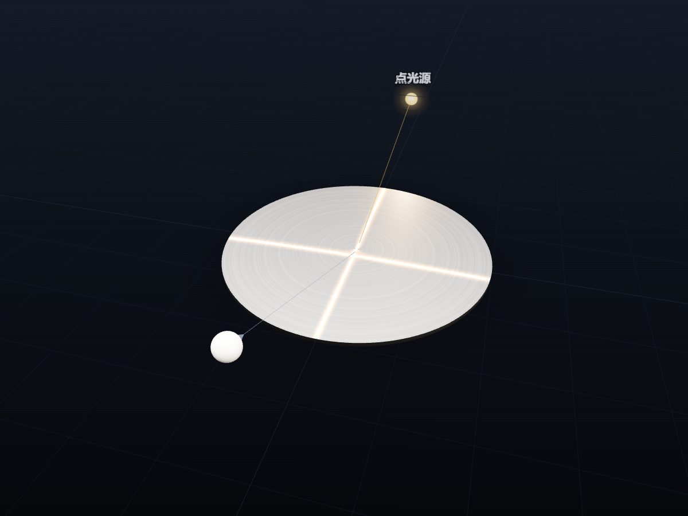

# 沟槽反射模拟器（Glitter Path）

金属表面的细沟槽——拉丝不锈钢、车削出来的锅底、唱片——在灯下会反射出一条亮线，而不是一个亮点。
这个模拟器把这条「反光路径」从微观的单条沟槽一路讲到宏观的亮线形状，配合毕导（毕啸天）的科普视频与论文使用。



**零依赖单文件**：`glitter-path.html` 一个文件（约 820 KB，内联 three.js r158），双击即可在浏览器里打开，离线可用。

## 核心物理

沟槽壁的法线没有沿槽分量 ⟹ 镜面反射保持光矢量的沿槽分量不变。于是表面上一点 *Q* 对观察者发亮的充要条件是

```
f(Q) = ( p̂ − q̂ ) · t̂ = 0
```

p̂ 为入射光传播方向，q̂ 为 *Q* 指向眼睛的方向，t̂ 为 *Q* 处的沟槽方向。
亮线必过镜面反射点 O；平行光照平行沟槽给出双曲线的一支，同心圆沟槽的亮线必过盘心。

## 四个模块

| 模块 | 内容 |
|---|---|
| 微观机理 | 半椭圆柱槽 x²/R² + z²/b² = 1 的三维光线追踪：单次反射、二次撞壁即吸收；可调入射角、方位角、光线数、槽深、反射光长度，显示法线与光子流动 |
| 光锥展示 | 反射面点阵上每点的出射方向锥：轴 t̂、半角 α = arccos\|p̂·t̂\|；演示「平行光 + 拉丝板各点光锥全等、同心圆盘各点各异」 |
| 亮线模拟 | 着色器逐像素求解 f(Q)=0：拉丝板 / 圆盘、平行光 / 点光源、沟槽角、无穷大反射面、沿镜面方向远离、观察者视角小窗、亮线上一点的半光锥、眼睛发出的圆锥，附 4 个预设场景 |
| 方程图像 | GeoGebra 式 2D 绘图：点光源·平行槽（三次曲线）、平行光·平行槽（双曲线一支）、平行光·同心槽（四次曲线）三种情况；参数可拖可输入，图上的点可拖；叠加渐近线、对顶角边界、Minnaert 远场双曲线等图层；同心槽附 6 个实拍场景预设 |

方程图像页画的是**未平方**方程「左边 − 右边」的零值集（逐格变号追踪 + 试位法细化），所以只画真正射进眼睛的那一叶，不会混进平方引入的伪解。

数值一致性由自检守住（结果以 `console.debug` 打到浏览器控制台）：亮线过镜面点 O、槽壁锥条件 r·ŷ = −sin i·cos φ、方程图像上的亮线点代回三维矢量形式的残差约 1e-16。

## 多设备

- **电脑**：参数在右侧（亮线模拟、方程图像）或顶部（微观机理、光锥展示）
- **手机 / 平板（≤860px）**：四个模块统一为「参数在上、画面在下」，拖动参数时画面实时可见；参数多的两页按组切换，可一键收起
- 触摸设备上放大触摸目标、适配安全区，并把 3D 渲染像素比封顶 1.5 以减轻发热

## 目录

```
glitter-path.html          成品单文件，可直接打开
build.ps1 / build.sh       由 src/ 拼装成品（两者产物等价）
src/01_shell.html          <title> + 全部 CSS + 页面骨架
src/02_core.js             控件构造器、分组栏、three 小工具、轨道相机、变换手柄、渲染循环
src/03_glitter.js          亮线数学、着色器、亮线模拟场景
src/04_micro_cones_ui.js   微观机理、光锥展示两个场景 + 界面装配
src/05_equations.js        方程图像模块；文件末尾调用 boot()，必须最后拼接
src/vendor/three.min.js    three.js r158（MIT）
poster.png                 截图
```

改完 `src/` 后重新拼装：

```powershell
powershell -File build.ps1     # 或：sh build.sh
```

## 实现说明

- three.js 用 r158 的 UMD 构建整包内联（r160 起官方不再提供 UMD，升级时需改 ESM 拼装）。
  `examples/jsm` 里的 OrbitControls、TransformControls、RoomEnvironment 无法同样内联，均为重写。
- 界面是原生 DOM + 一套小型控件构造器（`Slider / Toggle / Seg / Panel / GroupBar`），没有框架。
- 页面完全自包含、不发任何外部请求，可以直接发布到只允许静态单页的平台。

## 版本历史

本仓库早期是一个 React + TypeScript + Vite 的原型（v3.6 及以前，见 git 历史）。
2026-09 起换成现在的零依赖单文件版：物理判据与原型一致，在此基础上新增了方程图像模块与手机端适配，
修正了原型中平行光下镜面点 O 的符号错误，并按视频需要精简了界面。

## License

MIT © Bi Xiaotian。内联的 three.js 以其自身的 MIT 许可发布。
